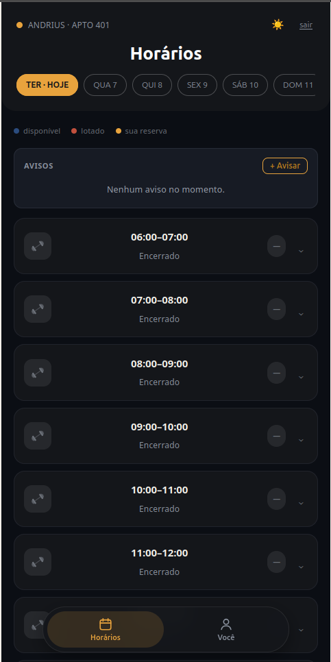
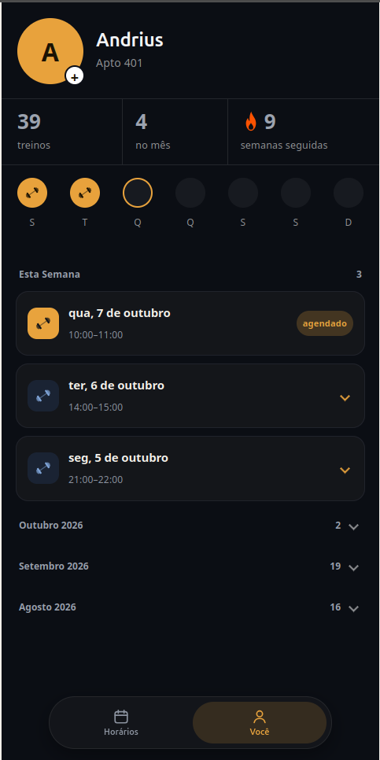
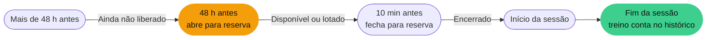
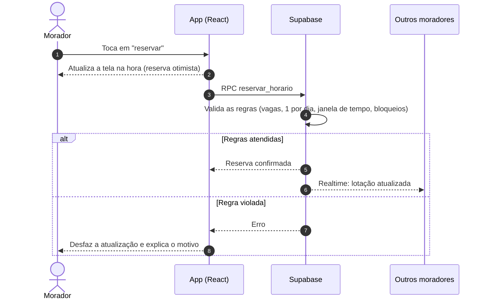
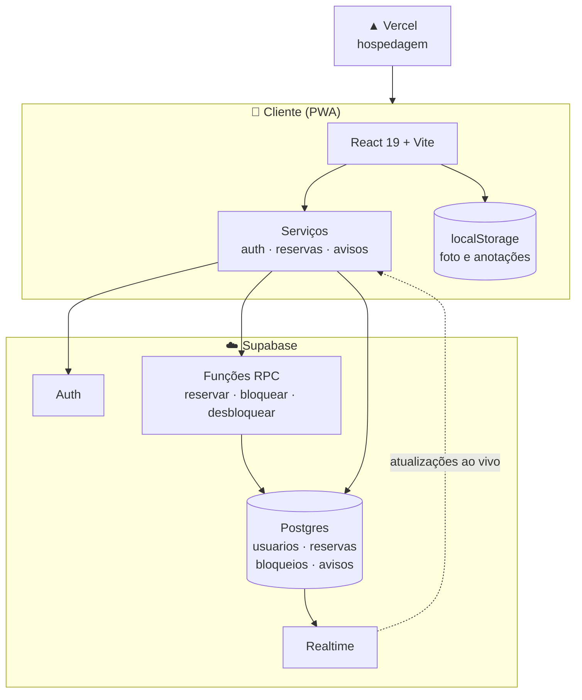

<div align="center">


<br><br>


**O app de reservas da academia do condomínio.**<br>
Veja a lotação em tempo real, garanta seu horário em segundos e acompanhe sua evolução treino a treino.

<br>

[**▶ Abrir o app**](https://academia-condominio-web.vercel.app) &nbsp;·&nbsp;
[Visão geral](#-visão-geral) &nbsp;·&nbsp;
[Funcionalidades](#-funcionalidades) &nbsp;·&nbsp;
[Como funciona](#-como-funciona) &nbsp;·&nbsp;
[Arquitetura](#-arquitetura) &nbsp;·&nbsp;
[Rodar localmente](#-rodar-localmente)

</div>

<br>

<div align="center">
<table>
  <tr>
    <td align="center"></td>
    <td align="center"></td>
  </tr>
  <tr>
    <td align="center"><b>Horários</b><br><sub>Disponibilidade por dia, status de cada faixa e avisos do condomínio</sub></td>
    <td align="center"><b>Perfil</b><br><sub>Resumo, faixa da semana, histórico por mês e anotações por treino</sub></td>
  </tr>
</table>
</div>

<br>

## ✨ Visão geral

O FitZone nasceu para acabar com a bagunça de reservar a academia por mensagem de grupo e planilha. Hoje, tudo acontece em uma única tela, com regras claras e atualização na hora para todo mundo.

<div align="center">
<table>
  <tr>
    <td align="center"><h2>4</h2><sub>vagas por horário</sub></td>
    <td align="center"><h2>7</h2><sub>dias à frente</sub></td>
    <td align="center"><h2>48 h</h2><sub>de antecedência<br>para reservar</sub></td>
    <td align="center"><h2>1 h</h2><sub>por sessão</sub></td>
  </tr>
</table>
</div>

### Antes e depois

| | Antes | Com o FitZone |
| --- | --- | --- |
| **Reservar** | Mensagem no grupo, esperando alguém responder | Um toque, com confirmação imediata |
| **Lotação** | Ninguém sabia quantas pessoas estariam lá | Status de cada horário em tempo real |
| **Manutenção** | Aviso solto, fácil de passar batido | Horário bloqueado no app, com o motivo |
| **Comunicados** | Perdidos no meio do grupo | Mural de avisos dentro do app |
| **Acompanhamento** | Nenhum | Histórico, sequência semanal e anotações |

Funciona direto no navegador e pode ser instalado na tela inicial do celular, como um aplicativo de verdade.

## 🚀 Funcionalidades

### 📅 Reservas

- Horários em **blocos de 1 hora**, com navegação pelos **próximos 7 dias**
- **Reserva otimista:** a tela atualiza no mesmo instante, enquanto o servidor confirma em segundo plano
- **Cancelamento** pelo próprio morador, com um toque
- Máximo de **uma reserva por morador no mesmo dia**
- Tema **claro e escuro**

Cada horário mostra seu estado de forma visual:

| Estado | Quando acontece |
| --- | --- |
| 🔵 **Disponível** | Ainda há vaga e o horário está aberto |
| 🔴 **Lotado** | As 4 vagas foram preenchidas |
| 🟠 **Sua reserva** | Você já reservou esse horário |
| ⚪ **Encerrado** | O horário já passou ou fechou para reservas |
| 🕒 **Ainda não liberado** | Faltam mais de 48 h para o início |
| 🔒 **Bloqueado** | A administração bloqueou o horário (ex.: manutenção) |

### 🔥 Perfil e evolução

- **Foto de perfil** com enquadramento por arrastar e zoom (com pinça, slider ou scroll), como no WhatsApp
- **Resumo:** total de treinos, treinos no mês e semanas seguidas
- **Faixa da semana** de segunda a domingo: dias treinados preenchidos, dias agendados com contorno e o dia de hoje destacado
- **Sequência semanal:** quantas semanas seguidas você treinou pelo menos uma vez

> [!NOTE]
> **Como a sequência é contada.** Cada semana (segunda a domingo) precisa ter pelo menos **1 treino concluído**. Treinar uma ou cinco vezes na mesma semana vale igual. Se a semana atual ainda não tem treino, ela **não quebra** a sequência: a contagem parte da semana passada. Já uma semana inteira sem treino zera tudo.

### 📝 Histórico com anotações

- **Semana atual em destaque** no topo, com treinos concluídos e agendados
- **Meses anteriores recolhidos**, que abrem ao toque e mostram a quantidade de treinos
- **Anotação por treino:** exercícios, cargas, como foi a sessão. O card expande ao toque, e a anotação pode ser editada ou removida
- Um treino só entra no histórico como **concluído depois do horário de término**, inclusive sessões que viram a meia-noite

### 📣 Avisos em tempo real

- Mural de comunicados do condomínio, atualizado sem recarregar a tela (**Supabase Realtime**)
- Mostra o **nome e o apartamento** de quem publicou
- Autores removem os próprios avisos, e administradores removem qualquer um

### 🛠️ Painel do administrador

- **Bloquear e desbloquear horários**, informando o motivo (como manutenção)
- **Publicar avisos** para todos os moradores
- **Remover qualquer aviso**, independentemente do autor

## ⚙️ Como funciona

### Ciclo de vida de um horário



### O que acontece quando você reserva



### Regras de negócio

| Regra | Valor |
| --- | --- |
| Vagas por horário | **4** |
| Reservas por morador no mesmo dia | **1** |
| Abertura da reserva | **48 h** antes do início |
| Encerramento da reserva | **10 min** antes do início |
| Horário bloqueado | Indisponível para moradores |
| Treino concluído | Conta após o **horário de término** |
| Semanas seguidas | Semanas (seg a dom) com **≥ 1 treino concluído** |

> [!IMPORTANT]
> As regras de reserva são validadas **no servidor**, por funções RPC do Supabase. Isso garante que elas valem mesmo que alguém tente burlar a interface.

## 🏗️ Arquitetura



### Stack

| Camada | Tecnologia | Papel |
| --- | --- | --- |
| Interface | **React 19** | Componentes e estado |
| Build | **Vite** | Desenvolvimento rápido e build de produção |
| Backend | **Supabase** | Autenticação, banco, RPC e Realtime |
| Hospedagem | **Vercel** | Deploy contínuo |
| Instalação | **PWA** | App na tela inicial, em tela cheia |
| Qualidade | **ESLint** | Padronização do código |

### Backend

| Recurso | Uso |
| --- | --- |
| Tabela `usuarios` | Perfil do usuário autenticado |
| Tabela `reservas` | Listar, criar e cancelar reservas |
| Tabela `bloqueios` | Horários indisponíveis |
| Tabela `avisos` | Comunicados |
| RPC `reservar_horario` | Cria a reserva validando as regras |
| RPC `bloquear_horario` | Bloqueia um horário (admin) |
| RPC `desbloquear_horario` | Libera um horário bloqueado (admin) |

<details>
<summary><b>📂 Estrutura do projeto</b></summary>

<br>

```text
src/
├── App.jsx                     # Sessão, splash e troca entre login e home
├── main.jsx                    # Ponto de entrada
├── supabaseClient.js           # Cliente Supabase
├── components/
│   ├── LoginScreen.jsx         # Autenticação
│   ├── HomeScreen.jsx          # Reservas, avisos e ações de admin
│   ├── ProfileScreen.jsx       # Resumo, semana, histórico e anotações
│   ├── AvatarCropper.jsx       # Enquadramento da foto de perfil
│   ├── FlameIcon.jsx           # Ícone da sequência semanal
│   ├── DumbbellIcon.jsx
│   └── SplashScreen.jsx        # Tela de carregamento
├── models/
│   └── timeSlots.js            # Lista dos horários
└── services/
    ├── authService.js          # Login, logout e usuário atual
    ├── reservationsService.js  # Reservas e bloqueios
    ├── announcementsService.js # Avisos
    ├── activityNotes.js        # Anotações por treino
    └── activityPhotos.js       # Foto de perfil
```

</details>

<details>
<summary><b>🧠 Decisões técnicas</b></summary>

<br>

- **Login por usuário:** o nome de usuário é mapeado para um e-mail interno e autenticado com `signInWithPassword`. O morador não precisa de e-mail real.
- **Sessão resiliente:** a sessão é revalidada quando a aba volta a ficar visível, evitando expiração silenciosa do token.
- **Logout com reload:** a página é recarregada ao sair, o que melhora o comportamento do autofill em alguns navegadores.
- **Reserva otimista:** a interface atualiza antes da confirmação e desfaz a mudança se o servidor recusar.
- **Tempo real:** reservas, bloqueios e avisos usam listeners do Supabase Realtime.
- **Foto e anotações locais:** por enquanto ficam no `localStorage`. A foto é recortada e redimensionada antes de salvar (cerca de 400×400, ~40 KB). Para sincronizar entre aparelhos, basta trocar as funções de `activityNotes.js` e `activityPhotos.js` por chamadas ao Supabase.
- **Treino concluído:** calculado com o relógio do aparelho, tratando corretamente sessões que atravessam a meia-noite.
- **Acessibilidade:** os cards do histórico funcionam por teclado (Enter e espaço) e informam o estado aberto ou fechado para leitores de tela.
- **Mobile first:** layout pensado para tela estreita, com navegação inferior e cantos arredondados.

</details>

## 💻 Rodar localmente

### Pré-requisitos

- [Node.js](https://nodejs.org) 18 ou superior
- Um projeto no [Supabase](https://supabase.com) com as tabelas e funções descritas em [Backend](#backend)

### Passo a passo

```bash
# 1. Instale as dependências
npm install

# 2. Crie o arquivo .env na raiz do projeto (veja a tabela abaixo)

# 3. Inicie o ambiente de desenvolvimento
npm run dev
```

| Variável | Descrição |
| --- | --- |
| `VITE_SUPABASE_URL` | URL do projeto Supabase |
| `VITE_SUPABASE_ANON_KEY` | Chave anônima (pública) do Supabase |

### Scripts

| Comando | O que faz |
| --- | --- |
| `npm run dev` | Servidor de desenvolvimento com Vite |
| `npm run build` | Gera a versão de produção |
| `npm run preview` | Serve a build localmente |
| `npm run lint` | Análise estática com ESLint |

### 📲 Instalar no celular

| Sistema | Como instalar |
| --- | --- |
| **iPhone** | Abra no Safari, toque em **Compartilhar** e depois em **Adicionar à Tela de Início** |
| **Android** | Abra no Chrome, toque no menu **⋮** e depois em **Instalar app** |

## 🗺️ Roadmap

**Já entregue**

- [x] Reservas com limite de vagas, janela de tempo e bloqueios
- [x] Avisos em tempo real
- [x] Perfil com foto enquadrada, resumo e sequência semanal
- [x] Histórico por semana e por mês
- [x] Anotação por treino

**Próximos passos**

- [ ] Sincronizar foto e anotações na conta (Supabase Storage)
- [ ] Meta semanal de treinos configurável
- [ ] Lembrete antes do horário reservado
- [ ] Compartilhar um treino como imagem
- [ ] Recuperação de senha
- [ ] Painel de administração com métricas de ocupação
- [ ] Documentação completa do schema do banco (tabelas, RLS e RPCs)

## ❓ Perguntas frequentes

<details>
<summary><b>Posso reservar mais de um horário no mesmo dia?</b></summary>

<br>

Não. Cada morador pode ter uma reserva por dia, para que mais pessoas consigam treinar.

</details>

<details>
<summary><b>Até quando posso reservar ou cancelar?</b></summary>

<br>

A reserva abre 48 horas antes do início do horário e fecha 10 minutos antes.

</details>

<details>
<summary><b>Por que meu treino ainda aparece como "agendado"?</b></summary>

<br>

Um treino só conta como concluído depois do horário de término. Se você reservou das 14h às 15h, ele fica como agendado até as 15h.

</details>

<details>
<summary><b>Minhas anotações e minha foto vão para outro celular?</b></summary>

<br>

Por enquanto, não. Elas ficam salvas no aparelho em que foram criadas. Sincronizar na conta está no roadmap.

</details>

## 📄 Licença

Distribuído sob a [licença MIT](LICENSE).

<br>

<div align="center">

**Feito com 💪 por [Andrius Anselmi](https://github.com/) para os moradores do condomínio.**

<sub>Gostou? Deixe uma ⭐ no repositório.</sub>

</div>
